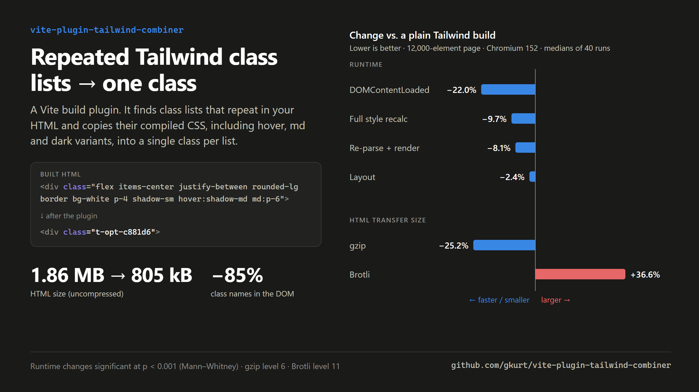

# vite-plugin-tailwind-combiner



A Vite **build** plugin for benchmarking. It finds elements in your built HTML that share the
same long Tailwind class list, collapses each list into one generated class
(`t-opt-a1b2c3`), and injects the matching CSS into an inline `<style>` in `<head>`.

```html
<!-- before -->
<div class="flex items-center justify-between rounded-lg border bg-white p-4 shadow-sm hover:shadow-md md:p-6">

<!-- after -->
<div class="t-opt-c881d6">
```

## Install

Install from GitHub:

```bash
npm install -D --allow-git=root github:gkurt/vite-plugin-tailwind-combiner
```

npm 12 and later refuse git dependencies unless you pass `--allow-git`; older npm versions don't need the flag.

Or copy `vitePluginTailwindCombiner.js` into your project and install its only dependency,
`npm install -D postcss`. Then import it from `vite-plugin-tailwind-combiner` or from your local
copy.

## Add it to `vite.config.js`

Put it **after** your Tailwind plugin:

```js
// vite.config.js
import { defineConfig } from 'vite'
import tailwindcss from '@tailwindcss/vite' // Tailwind v4. On v3, use your PostCSS setup as usual.
import tailwindCombiner from 'vite-plugin-tailwind-combiner' // or './vitePluginTailwindCombiner.js'

export default defineConfig({
  plugins: [
    tailwindcss(),
    tailwindCombiner({
      minLength: 4,       // only class lists with at least 4 classes
      minOccurrences: 5,  // ...that appear at least 5 times in the page
    }),
  ],
})
```

Then run `vite build`. The plugin only runs on builds: `vite dev` is left unchanged.

### Options

| Option           | Default    | Description                                                                 |
| ---------------- | ---------- | --------------------------------------------------------------------------- |
| `minLength`      | `4`        | Minimum number of distinct classes a list must contain to be considered.    |
| `minOccurrences` | `5`        | Minimum number of times the sorted list must appear in one HTML file.        |
| `prefix`         | `'t-opt-'` | Prefix for generated class names.                                            |
| `log`            | `true`     | Print a summary for each HTML file.                                          |

### Build output

```
[vite-plugin-tailwind-combiner] index.html
  elements optimized       650
  combined classes created 4
  injected <style>         2.09 kB

              before         after      change
  html      89.96 kB      34.98 kB    -61.1%
  gzip       1.08 kB       1.24 kB    +14.9%
```

## How it works

1. **Hook:** `transformIndexHtml` with `order: 'post'`. Tailwind has already built its CSS,
   Vite has already added the hashed `<link rel="stylesheet">`, and the bundle is available.
2. **Scan:** a tokenizer goes through every opening tag and reads `class` / `className`
   attributes (double-quoted, single-quoted or unquoted). It skips comments and the contents
   of `<script>`, `<style>`, `<textarea>` and `<title>`.
3. **Normalize:** each list is split on whitespace, de-duplicated and sorted, so
   `"p-4 flex"` and `"flex p-4"` count as the same list. Lists shorter than `minLength` are
   ignored; lists that appear fewer than `minOccurrences` times are dropped.
4. **Generate CSS:** for each remaining list the plugin looks up every rule in the emitted
   Tailwind stylesheet that targets one of its classes, then copies that rule with the
   selector changed to the generated class. Variants come along with it: `hover:` becomes
   `.t-opt-x:hover`, and `md:` / `dark:` keep their `@media`. `group-hover:` becomes
   `.t-opt-x:is(:where(.group):hover *)`. The original rule order and `@layer`/`@media`/`@supports`
   wrappers are kept, so the cascade gives the same result as the original utilities.
   Neighbouring rules with the same selector are merged.
5. **Rewrite:** matching attributes are replaced, and a
   `<style data-tailwind-combiner>` is inserted just before `</head>`. It goes after the
   Tailwind `<link>` so that the `@layer` order is unchanged.

The class name is the first 6 hex characters of the SHA-1 of the sorted list. The same list
always gets the same name across builds, and the name gets longer automatically if two lists
collide.

### Classes that stay on the element

Some classes can't be folded in safely, so they are kept next to the generated class
(`class="t-opt-c881d6 group js-toggle"`):

- **Classes with no CSS rule**, such as JS hooks (`js-toggle`) or third-party classes.
- **Marker classes used by other selectors**, such as `group`, `peer` and `dark`. Other
  elements' rules depend on these.
- **Classes that style other elements**, such as `space-y-4`, `divide-y` and `*:p-2`. Their
  selectors look like `:where(.space-y-4 > …)`.

If fewer than 2 classes in a list can be folded in, the list is skipped. The log shows it
under "candidates skipped".

## Limitations and benchmarking notes

- **Only HTML that exists at build time.** Markup rendered by React/Vue/Svelte at runtime is in JS
  bundles, not the HTML, so it isn't touched. The plugin suits static pages, SSG output, or
  benchmark pages that put large DOMs directly in `index.html`.
- **The original utilities are kept** in the main stylesheet, because JS-rendered markup may
  still use them.
- **Gzip size can go either way.** Repeated class strings already compress very well. The tiny
  example page gets 15% bigger gzipped; the 12k-element bench page gets 25% smaller. Raw HTML
  size always drops a lot, so parse and style timings matter more than transfer size.
- Run `vite preview` to check the build visually before trusting any numbers.

## Example

`example/` has a page with 650 repeated elements:

```bash
npm install
npm run example:build
npm run example:preview
```

## Browser benchmark

`bench/` builds one large page (1,500 cards, 12,000 styled elements) twice, without and with the
plugin. A runner page then loads the two builds in turn in an iframe:

```bash
npm run bench:build            # optional: npm run bench:build -- 3000  (number of cards)
npm run bench:serve            # then open http://localhost:4178/?rounds=40
```

Runner query options: `rounds` (default 20), `warmup` (3), `reps` (5), `memory=0` to skip the
memory measurement, and `enc=gzip` or `enc=br` to serve the HTML compressed. With `enc`, the
browser reports real transfer sizes and includes decompression in the timings. `bench:build`
also prints the compressed size of every output file and writes the numbers to `bench/dist/sizes.json`.

The server sends COOP/COEP headers, so timers have 5 µs resolution. Each round loads both builds,
alternating which goes first, and runs each forced-synchronous micro-benchmark 5 times. The page
pauses while the tab is hidden and throws away samples taken during a visibility change. When it
finishes, results are saved to `bench/results/*.json`.

Results: 40 rounds, Chromium 152, Windows 11, 24 threads (medians in ms; p is from a two-sided Mann–Whitney test):

| Metric                                  | Baseline | Optimized | Change | p       |
| --------------------------------------- | -------: | --------: | -----: | ------- |
| DOMContentLoaded                        |    52.11 |     40.63 | −22.0% | <0.001  |
| Full restyle (selector match + recalc)  |    20.23 |     18.26 |  −9.7% | <0.001  |
| innerHTML re-parse + style + layout     |    92.45 |     84.97 |  −8.1% | <0.001  |
| Rebuild layout tree (style + layout)    |    76.04 |     74.18 |  −2.4% | <0.001  |
| First contentful paint                  |   148.62 |    144.32 |  −2.9% | 0.025   |
| HTML parse (responseEnd → domInteractive) | 29.39  |     25.81 | −12.2% | 0.072   |
| Load event end                          |    63.29 |     61.37 |  −3.0% | 0.108   |

Raw results for every run are in [`bench/results/`](bench/results/). All runs used the Chromium 152
browser built into the Claude desktop app; results from other browsers would be a useful addition.

HTML size went from 1.86 MB to 805 kB, and class tokens in the DOM from 103,510 to 15,010.

### Compressed sizes

| Build output                   | Baseline | Optimized | Change |
| ------------------------------ | -------: | --------: | -----: |
| HTML, uncompressed             | 1864.23 kB | 805.47 kB | −56.8% |
| HTML, gzip -6                  |  21.22 kB |  15.88 kB | −25.2% |
| HTML, gzip -9                  |  21.02 kB |  15.53 kB | −26.1% |
| HTML, Brotli -11               |   6.24 kB |   8.53 kB | **+36.6%** |
| HTML + CSS, gzip -6            |  24.58 kB |  19.24 kB | −21.7% |
| HTML + CSS, Brotli -11         |   9.14 kB |  11.43 kB | **+25.0%** |

The CSS file is identical in both builds. Brotli's large window already shrinks the repeated
class strings to almost nothing. The plugin's inline `<style>` then adds bytes that Brotli
can't match against the external stylesheet, so the Brotli result grows by about 2.3 kB.

With the HTML served compressed, the plugin still helps every time the browser has to do
parsing or style work. Medians in ms, 30 rounds each, built-in Chromium 152; all changes p < 0.001:

| Metric                                   | gzip: base → opt        | Brotli: base → opt             |
| ---------------------------------------- | ----------------------- | ------------------------------ |
| Transfer size (HTML)                     | 21.5 kB → 16.2 kB       | 6.5 kB → 8.8 kB                |
| HTML download + decode                   | 0.96 → 0.65 (−32.5%)    | 1.38 → 0.83 (−39.8%)           |
| HTML parse (responseEnd → domInteractive) | 43.08 → 36.73 (−14.7%) | 42.91 → 37.62 (−12.3%)         |
| DOMContentLoaded                         | 48.12 → 40.99 (−14.8%)  | 48.97 → 42.09 (−14.0%)         |
| Full restyle                             | 20.33 → 18.29 (−10.1%)  | 20.30 → 18.36 (−9.6%)          |
| innerHTML re-parse + style + layout      | 91.34 → 85.32 (−6.6%)   | 90.53 → 84.64 (−6.5%)          |

Even when Brotli makes the transfer bigger, download + decode time still goes down, because the
browser has fewer bytes to decompress. The extra 2.3 kB costs about 2 ms on a 10 Mbit/s link,
less than the parse time saved. All of these runs are on localhost; a slow link would favour
whichever variant transfers fewer bytes.

## License

MIT
